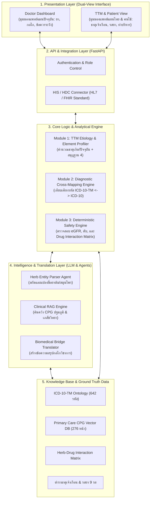
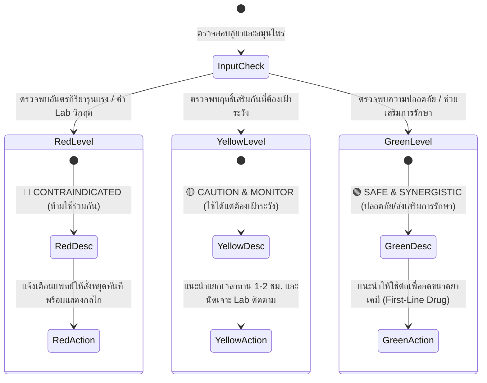
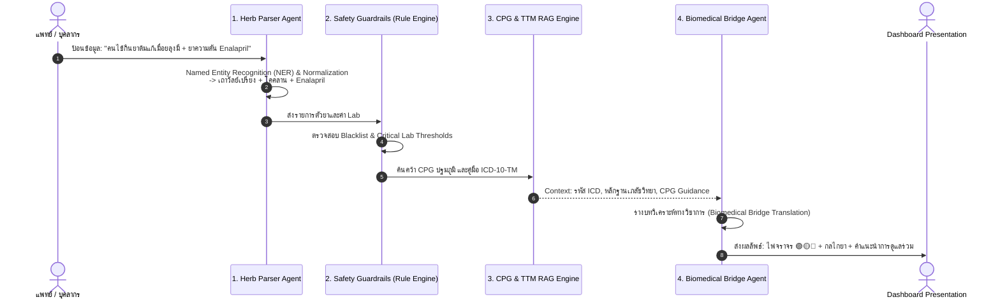

# TTM CrossBridge AI (สมานฉันท์ CDSS)
> **Intelligent Cross-Disciplinary Clinical Decision Support System for Thai Traditional & Conventional Co-Care**  
> *ระบบสนับสนุนการตัดสินใจทางคลินิกเพื่อผสานรอยต่อเวชกรรมไทยและแพทย์แผนปัจจุบันอย่างปลอดภัย*

---

## 📑 สารบัญ (Table of Contents)
1. [บทสรุปผู้บริหาร (Executive Summary)](#1-บทสรุปผู้บริหาร-executive-summary)
2. [ปัญหาและที่มาของโครงการ (Problem Statement & Clinical Gap)](#2-ปัญหาและที่มาของโครงการ-problem-statement--clinical-gap)
3. [คุณค่าหลักและจุดเด่นของระบบ (Value Proposition & Key Differentiators)](#3-คุณค่าหลักและจุดเด่นของระบบ-value-proposition--key-differentiators)
4. [โครงสร้างสถาปัตยกรรมระบบ (System Architecture)](#4-โครงสร้างสถาปัตยกรรมระบบ-system-architecture)
5. [ฟังก์ชันการทำงานหลัก 4 โมดูล (Core Modules & Logic Flow)](#5-ฟังก์ชันการทำงานหลัก-4-โมดูล-core-modules--logic-flow)
6. [การประยุกต์ใช้ AI และสถาปัตยกรรม Multi-Agent (AI & Agentic Workflow)](#6-การประยุกต์ใช้-ai-และสถาปัตยกรรม-multi-agent-ai--agentic-workflow)
7. [คลังข้อมูลอ้างอิงและมาตรฐานที่นำมาใช้ (Data Sources & Standards)](#7-คลังข้อมูลอ้างอิงและมาตรฐานที่นำมาใช้-data-sources--standards)
8. [กรณีศึกษาจำลองทางคลินิก (Clinical Simulation Scenarios)](#8-กรณีศึกษาจำลองทางคลินิก-clinical-simulation-scenarios)
9. [การออกแบบ UI/UX และ Interactive User Flow](#9-การออกแบบ-uiux-และ-interactive-user-flow)
10. [แผนการพัฒนา Prototype และกลยุทธ์การนำเสนอ (Hackathon Roadmap & Pitching)](#10-แผนการพัฒนา-prototype-และกลยุทธ์การนำเสนอ-hackathon-roadmap--pitching)

---

## 1. บทสรุปผู้บริหาร (Executive Summary)

ในระบบสุขภาพไทย ประชาชนกว่า 70% มีการดูแลสุขภาพร่วมกันระหว่างการแพทย์แผนปัจจุบันและการแพทย์แผนไทย โดยเฉพาะการใช้สมุนไพรและยาต้มยาหม้อ แต่ความจริงที่น่าตกใจคือ **แพทย์แผนปัจจุบันไม่เคยได้รับการเรียนการสอนด้านเวชกรรมไทย** ส่งผลให้เกิดปฏิกิริยาสะท้อนกลับในห้องตรวจคือ **“สั่งให้คนไข้หยุดกินสมุนไพรทั้งหมดทันที”** เพราะความกังวลเรื่องผลต่อตับและไต 

ผลกระทบคือ:
1. **คนไข้แอบกิน**: ผู้ป่วยเลือกปกปิดข้อมูล ทำให้แพทย์ไม่ทราบประวัติยาที่แท้จริง เสี่ยงต่ออันตรกิริยาระหว่างยา (Herb-Drug Interaction: HDI) ที่เป็นอันตรายถึงชีวิต
2. **เสียโอกาสในการรักษา**: ยาสมุนไพรไทยหลายชนิด เช่น *เถาวัลย์เปรียง, ขมิ้นชัน, ฟ้าทะลายโจร* มีงานวิจัยรองรับและเป็นนโยบายยานวัตกรรมทางเลือกแรก (First Line Drugs) ซึ่งสามารถช่วยลดการใช้ยาแก้ปวดกลุ่ม NSAIDs ที่ทำลายไตได้อย่างมีนัยสำคัญ แต่กลับถูกสั่งระงับใช้

**TTM CrossBridge AI** คือระบบ CDSS (Clinical Decision Support System) ดิจิทัลที่ถูกสร้างขึ้นเพื่อเป็น **"สะพานเชื่อมภาษาทางวิชาการระหว่างแพทย์สองแผน"** โดยระบบจะ:
- แปลงข้อมูลอาการและประวัติผู้ป่วยเป็น **สมุฏฐาน 4 และธาตุเจ้าเรือน** พร้อมคำอธิบายเชิงพยาธิสรีรวิทยา (Pathophysiology)
- **เทียบเคียงโรค** ระหว่างแผนไทยกับแผนปัจจุบัน (ICD-10-TM ⟷ ICD-10) ตามมาตรฐานกระทรวงสาธารณสุข
- ประเมิน **อันตรกิริยาระหว่างสมุนไพรกับยาแผนปัจจุบัน (Herb-Drug Interaction)** ด้วยระบบไฟจราจร 🟢🟡🔴 แจ้งเตือนระดับความปลอดภัย กลไกทางเภสัชวิทยา และคำแนะนำทางคลินิกที่พร้อมนำไปใช้ได้ทันที

---

## 2. ปัญหาและที่มาของโครงการ (Problem Statement & Clinical Gap)

อ้างอิงตามเอกสารเชิงยุทธศาสตร์ของกรมการแพทย์แผนไทยและการแพทย์ทางเลือก [KH_เวชกรรมไทย.pdf](file:///C:/Users/Piyanut/Desktop/TTM%20Hackathon/KH_เวชกรรมไทย.pdf):

```
       [ฝั่งคนไข้]                                     [ฝั่งแพทย์แผนปัจจุบัน]
   กินยาสมุนไพร / ยาต้ม                            ไม่เคยเรียนศาสตร์แผนไทย
           │                                                │
           ▼                                                ▼
  มีความเชื่อมั่นในภูมิปัญญา ──────────── ทับซ้อน ──────────── ไม่รู้กลไก ไม่มั่นใจความปลอดภัย
           │                                                │
           ▼                                                ▼
   "หมอสั่งห้าม... เลยแอบกิน"                           "สั่งให้หยุดกินยาทุกชนิด!"
           │                                                │
           └──────────────────► วิกฤตความปลอดภัย ◄───────────────┘
                                - ปัญหาเลือดออกในทางเดินอาหาร (Bleeding)
                                - ภาวะน้ำตาลตก / ความดันตกเฉียบพลัน
                                - ไตวายเฉียบพลันจากยาหม้อที่ไม่ทราบส่วนประกอบ
```

### การตอบโจทย์ 5 ช่องว่างเชิงระบบ (Aligning with Hackathon 5 GAPs)
1. **GAP 2: Herb-Drug Interaction & Cross-Disciplinary Safety Integration (จุดเน้นหลัก)**: เชื่อมช่องว่างความปลอดภัยด้วยฐานข้อมูล HDI เชิงเภสัชวิทยาแบบ Real-time
2. **GAP 1: Quantifiable Diagnosis**: แปลงแนวคิดธาตุเจ้าเรือนและสมุฏฐานให้เป็นตัวแปรที่มีเกณฑ์ประเมินชัดเจน (Standardized Profiling)
3. **GAP 3: Workforce Capability & CDSS**: ช่วยแบ่งเบาภาระงานของบุคลากรทั้งใน รพ.สต. และโรงพยาบาลศูนย์ ด้วยระบบแนะนำการลงรหัส ICD-10-TM อัตโนมัติ
4. **GAP 4: Real-World Evidence (RWE)**: บันทึกข้อมูลการใช้ยาสมุนไพรร่วมกับยาแผนปัจจุบันอย่างเป็นระบบ เพื่อเป็น Big Data พัฒนา CPG ต่อไป
5. **GAP 5: Accessibility & Health Literacy**: ให้ข้อมูลแนะนำการปรับธาตุและพฤติกรรมแก่ประชาชนอย่างถูกต้องตามหลักวิชาการ

---

## 3. คุณค่าหลักและจุดเด่นของระบบ (Value Proposition & Key Differentiators)

| มิติการประเมิน | วิธีการดั้งเดิม (Conventional Practice) | TTM CrossBridge AI |
|---|---|---|
| **ทัศนคติของแพทย์** | ปฏิเสธเหมารวม (*"หยุดกินทั้งหมด"*) | ตัดสินใจบนหลักฐานเชิงประจักษ์ (*"หยุดตัวที่เสี่ยง สนับสนุนตัวที่ปลอดภัย"*) |
| **การสื่อสารระหว่างแผน** | ใช้คนละภาษา (วาตะ/ปิตตะ vs Cytokines/Nerve) | ระบบแปลเชื่อมโยงคำศัพท์และกลไกพยาธิสรีรวิทยาให้อัตโนมัติ |
| **การตรวจสอบยา (Drug Check)** | ดูเฉพาะยาในใบสั่งยาแผนปัจจุบัน | ตรวจสอบ Cross-checking ระหว่างยาแผนปัจจุบัน + ยาสมุนไพร/ยาต้ม |
| **การบันทึกข้อมูล** | บันทึกเฉพาะรหัส ICD-10 สากล | บันทึกเชื่อมโยง ICD-10-TM ควบคู่ ICD-10 สำหรับเบิกจ่ายสิทธิบัตรทอง |
| **บทบาทต่อระบบสาธารณสุข** | เพิ่มภาระค่าใช้จ่ายยานอกประเทศ | ส่งเสริมสมุนไพร First-Line Drugs ลดงบประมาณค่ายาเคมีสังเคราะห์ |

---

## 4. โครงสร้างสถาปัตยกรรมระบบ (System Architecture)



---

## 5. ฟังก์ชันการทำงานหลัก 4 โมดูล (Core Modules & Logic Flow)

### 🌿 Module 1: TTM Etiology & Element Profiler (วิเคราะห์สมุฏฐานและธาตุเจ้าเรือน)
* **ตรรกะการคำนวณ (Algorithm)**:
  * **ธาตุเจ้าเรือนเกิด (Birth Element)**: คำนวณจากวันเกิดและเดือนเกิดตามหลักคัมภีร์เวชศึกษา (อ้างอิง [ธาตุเจ้าเรือน.pdf](file:///C:/Users/Piyanut/Desktop/TTM%20Hackathon/ธาตุเจ้าเรือน.pdf)):
    * *เดือน 5, 6, 7 (เม.ย. - มิ.ย.)* ➡️ **ธาตุลม (วาโย)**
    * *เดือน 8, 9, 10 (ก.ค. - ก.ย.)* ➡️ **ธาตุน้ำ (อาโป)**
    * *เดือน 11, 12, 1 (ต.ค. - ธ.ค.)* ➡️ **ธาตุดิน (ปถวี)**
    * *เดือน 2, 3, 4 (ม.ค. - มี.ค.)* ➡️ **ธาตุไฟ (เตโช)**
  * **ธาตุเจ้าเรือนปัจจุบัน & สมุฏฐานแปรปรวน (Current Element State)**:
    * ประเมินร่วมกับ **อายุสมุฏฐาน** (ปฐมวัย 0-16 ปี เสมหะ / มัชฌิมวัย 16-32 ปี ปิตตะ / ปัจฉิมวัย 32 ปีขึ้นไป วาตะ)
    * ประเมิน **อุตุสมุฏฐาน** (คิมหันต์, วสันต์, เหมันต์) และ **กาลสมุฏฐาน** (ช่วงเวลาที่มีอาการกำเริบ)
* **Biomedical Translation Output**: สร้างบทสรุปกลไกธาตุเทียบเคียงระบบสรีรวิทยา เช่น *"ผู้ป่วยอยู่ในปัจฉิมวัย ธาตุลมกำเริบ (Vata Aggravation) ร่วมกับอุตุสมุฏฐานฝน สัมพันธ์กับภาวะปลายประสาทอักเสบและการไหลเวียนของ Microcirculation ลดลง"*

---

### 🔄 Module 2: Diagnostic Cross-Mapping Engine (เทียบเคียงโรคแผนไทย-สากล)
* **ตรรกะการทำงาน**:
  * รับข้อความอาการสำคัญ (Chief Complaint) ➡️ ค้นหาโรคแผนไทยและรหัส **ICD-10-TM (หมวด U)**
  * แมปเข้ากับรหัส **ICD-10 สากล** ตาม [คู่มือเปรียบเทียบโรคและอาการและหัตถการด้านการแพทย์แผนไทย.pdf](file:///C:/Users/Piyanut/Desktop/TTM%20Hackathon/คู่มือเปรียบเทียบโรคและอาการและหัตถการด้านการแพทย์แผนไทย.pdf)
  * **คัดกรอง Red Flags ทางคลินิก (Inclusion/Exclusion Rules)** ตาม [แนวทางปฏิบัติเวชกรรมดูแลผู้ป่วยปฐมภูมิ.pdf](file:///C:/Users/Piyanut/Desktop/TTM%20Hackathon/แนวทางปฏิบัติเวชกรรมดูแลผู้ป่วยปฐมภูมิ.pdf):
    * ตัวอย่างเกณฑ์เบาหวาน: หาก $FBS > 180\text{ mg/dL}$ หรือ $HbA1c > 8.0\%$ หรือ $eGFR < 60\text{ mL/min/1.73m}^2$ ระบบจะขึ้นเตือน **"Exclusion Criteria: ห้ามรักษาด้วยสมุนไพรเดี่ยว ต้องส่งต่อแพทย์เฉพาะทางทันที"**

---

### 🛡️ Module 3: Herb-Drug Interaction (HDI) & Safety Guard
* **ระบบประเมิน 3 ระดับ (Traffic Light Alert)**:



* **ตัวอย่าง Interaction Matrix ในระบบ**:
  1. 🔴 **Red (อันตราย)**:
     * *ฟ้าทะลายโจร + Warfarin / Aspirin / Clopidogrel*: ฟ้าทะลายโจรมีฤทธิ์ Antiplatelet ยับยั้งการรวมตัวของเกล็ดเลือด เพิ่มความเสี่ยง Major Bleeding
     * *ยาสมุนไพรไม่ทราบสูตร + ผู้ป่วย eGFR < 60 หรือ Serum Cr > 1.5*: เสี่ยงภาวะ Hyperkalemia และผงยาไม่ได้มาตรฐาน
  2. 🟡 **Yellow (เฝ้าระวัง)**:
     * *ชะพลู / มะระขี้นก + Metformin / Glipizide*: มีฤทธิ์ลดน้ำตาลในเลือด เสี่ยงเกิดภาวะ Hypoglycemia แนะนำให้เฝ้าระวัง FBS และลดขนมหวาน
     * *ขมิ้นชัน + ยาลดความดัน (Amlodipine)*: อาจเพิ่มการดูดซึมยาบางกลุ่ม แนะนำให้รับประทานห่างกันอย่างน้อย 2 ชั่วโมง
  3. 🟢 **Green (ปลอดภัยและสนับสนุน)**:
     * *เถาวัลย์เปรียง + ยาแผนปัจจุบัน*: ฤทธิ์ต้านการอักเสบเทียบเท่า Diclofenac แต่ไม่ระคายเคืองกระเพาะอาหารและไต ช่วยลดการใช้ยาแก้ปวดกลุ่ม NSAIDs ในผู้สูงอายุ

---

### 📋 Module 4: Integrated Co-Care Plan & Export
* ออกแบบ **Clinical Decision Support Card**:
  * สรุป 1 หน้ากระดาษสำหรับแพทย์แผนปัจจุบัน นำไปแนบในเวชระเบียน (EMR)
  * สรุป 1 หน้าสำหรับคนไข้: รายการสมุนไพรที่กินต่อได้, รายการที่ต้องหยุด, เมนูอาหารปรับธาตุ, และท่าบริหารฤๅษีดัดตนที่เหมาะสม

---

## 6. การประยุกต์ใช้ AI และสถาปัตยกรรม Multi-Agent (AI & Agentic Workflow)

เพื่อให้เป็นไปตามข้อกำหนดใน [00.1_Prototype ที่คาดหวัง.pdf](file:///C:/Users/Piyanut/Desktop/TTM%20Hackathon/00.1_Prototype%20ที่คาดหวัง.pdf) เรื่องการนำเสนอ **AI Agent, Prompt Workflow, และ Knowledge Base**:

### ผังการทำงานของ AI Agents (Multi-Agent Pipeline)



### การจัดสรรบทบาทของ AI:
1. **Herb Normalization & Entity Extraction Agent**:
   * *หน้าที่*: แปลงภาษาชาวบ้านและชื่อตำรับพื้นบ้าน ให้เป็นชื่อวิทยาศาสตร์ และชื่อสมุนไพรมาตรฐานในบัญชียาหลักแห่งชาติ
2. **Hybrid RAG Engine (Retrieval-Augmented Generation)**:
   * *หน้าที่*: ดึงข้อมูลอ้างอิงตรงจากเอกสารทางการ 514 หน้าของกรมฯ ไม่เกิดปัญหาการตอบมั่ว (Hallucination) โดยดึงจากคู่มือเปรียบเทียบโรค และ CPG ปฐมภูมิ
3. **Biomedical Translation Agent (Prompt Engineering)**:
   * *System Prompt Design*: บังคับให้ AI ตอบในมุมมองของ **Clinical Pharmacologist & Integrative Medicine Specialist** สื่อสารด้วยภาษาที่แพทย์แผนปัจจุบันเข้าใจ (เน้น Mechanism of action, Pharmacokinetics, Half-life, Safety window)

---

## 7. คลังข้อมูลอ้างอิงและมาตรฐานที่นำมาใช้ (Data Sources & Standards)

ข้อมูลที่ใช้ในระบบดึงมาจากเอกสารหลักของโครงการทั้งหมด:

1. **[คู่มือเปรียบเทียบโรคและอาการและหัตถการด้านการแพทย์แผนไทย.pdf](file:///C:/Users/Piyanut/Desktop/TTM%20Hackathon/คู่มือเปรียบเทียบโรคและอาการและหัตถการด้านการแพทย์แผนไทย.pdf)** (ปี 2568):
   * ใช้ทำ Ontology Mapping ระหว่างรหัสโรค 642 รหัส ICD-10-TM กับ ICD-10 สากล
2. **[แนวทางปฏิบัติเวชกรรมดูแลผู้ป่วยปฐมภูมิ.pdf](file:///C:/Users/Piyanut/Desktop/TTM%20Hackathon/แนวทางปฏิบัติเวชกรรมดูแลผู้ป่วยปฐมภูมิ.pdf)** (ปี 2568, 276 หน้า):
   * ใช้เป็นเกณฑ์มาตรฐานทางคลินิก (Inclusion/Exclusion criteria) ของ 5 กลุ่มโรคหลัก
3. **[ธาตุเจ้าเรือน.pdf](file:///C:/Users/Piyanut/Desktop/TTM%20Hackathon/ธาตุเจ้าเรือน.pdf)**:
   * ใช้อัลกอริทึมวงกลมวิเคราะห์สุขภาพตามธาตุเจ้าเรือนของ พญ.เพ็ญนภา ทรัพย์เจริญ
4. **[KH_เวชกรรมไทย.pdf](file:///C:/Users/Piyanut/Desktop/TTM%20Hackathon/KH_เวชกรรมไทย.pdf) และ [info_เวชกรรมไทย.png](file:///C:/Users/Piyanut/Desktop/TTM%20Hackathon/info_เวชกรรมไทย.png)**:
   * นโยบายส่งเสริมสมุนไพร First Line Drugs (ฟ้าทะลายโจร, ขมิ้นชัน, เถาวัลย์เปรียง) และรสยา 9 รส
5. **[ตำราอ้างอิงด้านการแพทย์แผนไทย.pdf](file:///C:/Users/Piyanut/Desktop/TTM%20Hackathon/ตำราอ้างอิงด้านการแพทย์แผนไทย.pdf)** (514 หน้า):
   * หลักการแพทย์แผนไทย, สมุฏฐานวิทยา และเภสัชกรรมไทย

---

## 8. กรณีศึกษาจำลองทางคลินิก (Clinical Simulation Scenarios)

### กรณีศึกษาที่ 1: การป้องกันอันตรายร้ายแรง (Red Alert Intervention)
* **ผู้ป่วย**: หญิงอายุ 68 ปี โรคหลอดเลือดสมองขาดเลือด (Ischemic Stroke) ได้รับยา **Warfarin 3 mg**
* **ข้อมูลนำเข้า**: ผู้ป่วยเริ่มมีอาการหวัด เจ็บคอ ญาติพาไปซื้อ **"ฟ้าทะลายโจรแคปซูล"** มารับประทาน
* **ผลการประมวลผลของระบบ**:
  * 🔴 **RED ALERT**: ฟ้าทะลายโจร (Andrographis paniculata) + Warfarin
  * **กลไก**: สาร Andrographolide ยับยั้ง Platelet Activating Factor (PAF) และเอนไซม์ CYP2C9 ซึ่งเป็นเอนไซม์หลักที่สลาย Warfarin ส่งผลให้ระดับ Warfarin ในเลือดสูงขึ้น เสี่ยงต่อภาวะเลือดออกในสมองซ้ำ
  * **Actionable Advice**: **"ให้สั่งหยุดฟ้าทะลายโจรทันที"** แนะนำใช้ยาแผนปัจจุบันที่ปลอดภัย หรือใช้ยาน้ำแก้ไอสมุนไพรรสมะขามป้อมที่ไม่รบกวนการแข็งตัวของเลือดแทน

---

### กรณีศึกษาที่ 2: การส่งเสริมสมุนไพรเป็น First-Line Drug (Green Light Support)
* **ผู้ป่วย**: ชายอายุ 55 ปี โรคข้อเข่าเสื่อม ปวดเข่าเรื้อรัง (M17.9 / U60.20 ลมจับโปงแห้งเข่า) มีประวัติแผลในกระเพาะอาหาร (PUD)
* **ข้อมูลนำเข้า**: ผู้ป่วยแจ้งว่ารับประทาน **"สารสกัดเถาวัลย์เปรียง"** ร่วมกับ Paracetamol
* **ผลการประมวลผลของระบบ**:
  * 🟢 **GREEN (SUPPORT & SAFE)**: เถาวัลย์เปรียง + Paracetamol
  * **กลไก**: มีฤทธิ์ต้านการอักเสบผ่านกลไกยับยั้ง Eicosanoid pathway โดยมีประสิทธิภาพเทียบเท่ายา Ibuprofen / Diclofenac แต่ไม่พบผลข้างเคียงต่อเยื่อบุกระเพาะอาหารและไม่ทำให้การทำงานของไตเสื่อมลง
  * **Actionable Advice**: **"แนะนำให้รับประทานต่อได้"** ถือเป็นการรักษาตามแนวทาง CPG ช่วยให้ผู้ป่วยหลีกเลี่ยงการใช้ยาเคมีสังเคราะห์กลุ่ม NSAIDs

---

## 9. การออกแบบ UI/UX และ Interactive User Flow

```
[Screen 1: Patient Clinical Intake]
┌────────────────────────────────────────────────────────────────────────┐
│  👤 TTM CrossBridge Clinical Intake                                    │
│  HN: 1234567   ชื่อ-สกุล: นายสมศักดิ์ รักไทย   วันเกิด: 15/05/2505 (64 ปี) │
│  อาการสำคัญ (CC): ปวดข้อเข่าทั้งสองข้าง ขัด บวมเล็กน้อย                   │
│  ────────────────────────────────────────────────────────────────────  │
│  💊 ยาแผนปัจจุบันที่ใช้ประจำ:                                           │
│  [ Metformin 500 mg ]  [ Amlodipine 5 mg ]  [ Aspirin 81 mg ]          │
│  ────────────────────────────────────────────────────────────────────  │
│  🌿 สมุนไพร / ยาต้มที่คนไข้รับประทาน:                                   │
│  [ พิมพ์ชื่อสมุนไพร หรือ อัปโหลดรูปซองยาต้ม: "เถาวัลย์เปรียง, ฟ้าทะลายโจร" ] │
│                                                [ 🔍 วิเคราะห์ข้อมูล ]   │
└────────────────────────────────────────────────────────────────────────┘
                                    │
                                    ▼
[Screen 2: Intelligent Decision Dashboard (Dual View)]
┌────────────────────────────────────────────────────────────────────────┐
│  📊 ผลการวิเคราะห์และเชื่อมโยงข้อมูล (CrossBridge Analysis)             │
│  ┌──────────────────────────────┐ ┌──────────────────────────────────┐ │
│  │ 🌿 มิติเวชกรรมไทย (TTM View) │ │ 🩺 มิติแผนปัจจุบัน (Biomedical)   │ │
│  │ - ธาตุเจ้าเรือนเกิด: ธาตุลม    │ │ - ICD-10: M17.9 Knee OA        │ │
│  │ - สมุฏฐาน: ลมจับโปงแห้งเข่า   │ │ - Red Flags: eGFR = 72 (ผ่าน)  │ │
│  │ - รหัส: U60.20               │ │ - FBS = 138 (อยู่ในเกณฑ์ CPG)   │ │
│  └──────────────────────────────┘ └──────────────────────────────────┘ │
│  ────────────────────────────────────────────────────────────────────  │
│  🚨 ความปลอดภัยและอันตรกิริยาระหว่างยา (Safety Evaluation):            │
│                                                                        │
│  🔴 [RED STOP] ฟ้าทะลายโจร ⟷ Aspirin 81 mg                            │
│     * กลไก: เพิ่มความเสี่ยง Bleeding รุนแรง ➡️ 【สั่งหยุดทันที】       │
│                                                                        │
│  🟢 [GREEN OK] เถาวัลย์เปรียง ⟷ ยาแผนปัจจุบัน                           │
│     * กลไก: ลดปวดเทียบเท่า NSAIDs แต่ปลอดภัยต่อไต ➡️ 【รับประทานต่อได้】 │
│  ────────────────────────────────────────────────────────────────────  │
│  [ 🖨️ พิมพ์ใบสรุปสำหรับเวชระเบียน ]      [ 📱 ส่งคำแนะนำการดูแลตนเองให้คนไข้ ] │
└────────────────────────────────────────────────────────────────────────┘
```

---

## 10. แผนการพัฒนา Prototype และกลยุทธ์การนำเสนอ (Hackathon Roadmap & Pitching)

### แผนการพัฒนา Prototype ภายในช่วงการแข่งขัน (Technical Stack)
1. **Frontend**: Next.js 14 / Tailwind CSS หรือ Streamlit ในกรณีที่ต้องการ Demo รวดเร็ว
2. **Backend**: Python FastAPI สำหรับจัดการ Logic Flow และ Rule-based Engine
3. **Database**: SQLite / In-memory JSON เก็บตารางรหัส ICD-10-TM และ Interaction Matrix
4. **AI Layer**: Gemini API (Model: Gemini 1.5 Pro / Flash) ผ่าน Function Calling เพื่อให้ Output ออกมาเป็น Structured JSON แน่นอน

### โครงร่างการนำเสนอ Pitch Deck (5 นาทีพิชิตใจกรรมการ)
* **นาทีที่ 1 (The Hook & Pain Point)**:
  * เปิดด้วยภาพจริงในห้องตรวจ: คนไข้แอบกินสมุนไพร หมอสั่งหยุดเพราะไม่รู้ ภาวะความเสี่ยงของคนไข้ และงบประมาณค่ายาเคมีที่บานปลาย
* **นาทีที่ 2 (Our Solution: TTM CrossBridge)**:
  * แสดงให้เห็นระบบที่ไม่ได้บอกให้หยุด แต่เปลี่ยนเป็น **"สะพานเชื่อมความปลอดภัย"** วิเคราะห์สมุฏฐาน + แปลงโรค + ตรวจจับ Interaction
* **นาทีที่ 3 (Live Interactive Prototype Demo)**:
  * กดทดสอบระบบจริง: ใส่เคสคนไข้กิน Aspirin + ฟ้าทะลายโจร + เถาวัลย์เปรียง ระบบเตือนไฟแดงและไฟเขียวทันที
* **นาทีที่ 4 (Under the Hood & Feasibility)**:
  * โชว์ System Architecture, ความถูกต้องตาม CPG ปี 2568 และ ICD-10-TM 642 รหัส จากเอกสารทางการของกรมฯ
* **นาทีที่ 5 (Impact & Vision)**:
  * ขับเคลื่อนนโยบาย First-Line Drug, ลดภาระงบประมาณระบบสุขภาพบัตรทอง, และขยายผลสู่ระบบ HIS ทั่วประเทศ

---

*เอกสารนี้จัดทำขึ้นโดยอ้างอิงข้อมูลวิชาการและระเบียบเกณฑ์การแข่งขัน Thai Traditional Medicine Digital Health & AI Hackathon กรมการแพทย์แผนไทยและการแพทย์ทางเลือก กระทรวงสาธารณสุข*
