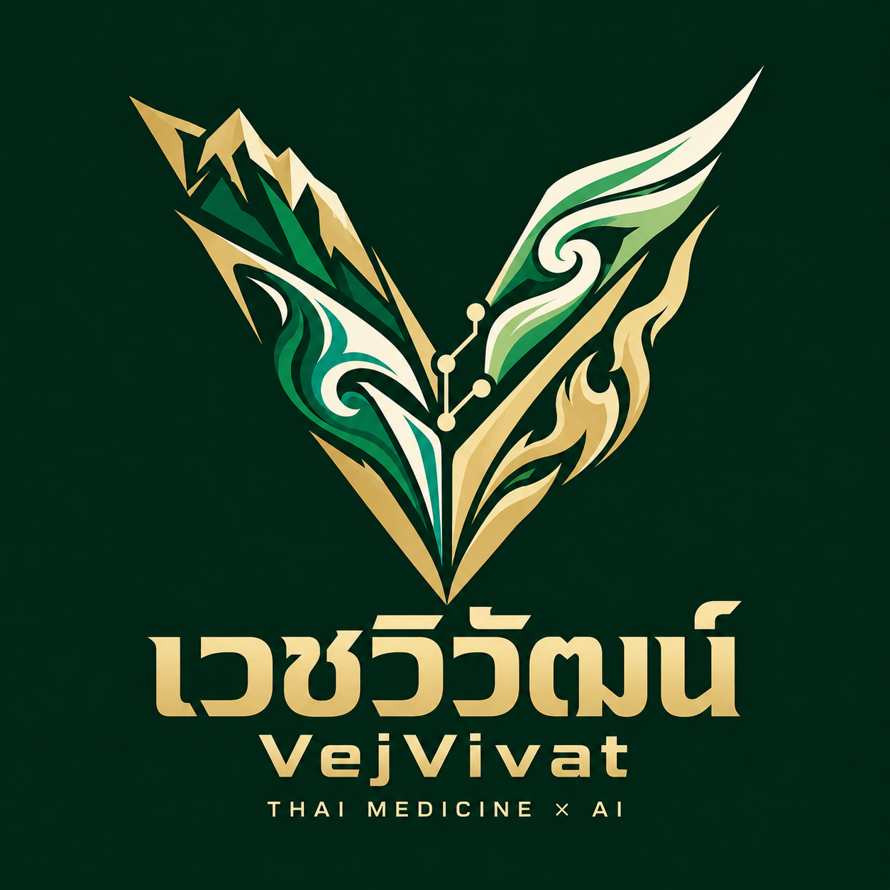
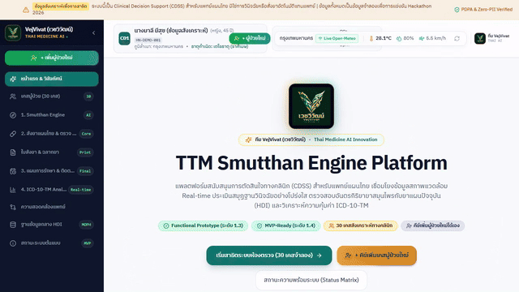

# TTM Smutthan Engine Platform 🌿🩺
<p align="center">
  
  <br />
  <b>พัฒนาโดย ทีม VejVivat (เวชวิวัฒน์) — Thai Medicine AI Innovation</b><br />
  <i>ระบบสนับสนุนการตัดสินใจทางคลินิกแพทย์แผนไทย เชื่อมโยงสารสนเทศสุขภาพ และตรวจจับอันตรกิริยาสมุนไพร-ยาแผนปัจจุบัน</i><br />
  <b>TTM Hackathon 2026</b> — สาขา Health Informatics & Thai Traditional Medicine Innovation
</p>

[](src/tests)
[](tsconfig.json)
[](package.json)
[](tailwind.config.js)
[-teal.svg)](docs/00-prototype-status.md)
[](data/synthetic/cases.json)
[](src/components/patient/PatientIntakeModal.tsx)
[](src/pages/CarePlanPage.tsx)
[-success.svg)](scripts/check-pii.py)
[](https://clangxcl.github.io/TTM_Hackathon_2026/)

---

## 🎬 วิดีโอจำลองการทำงานจริงของระบบ (Program Simulation Video)

<p align="center">
  <a href="https://clangxcl.github.io/TTM_Hackathon_2026/videos/ttm-vejvivat-demo.mp4">
    
  </a>
  <br />
  <b>▶️ <a href="https://clangxcl.github.io/TTM_Hackathon_2026/videos/ttm-vejvivat-demo.mp4">คลิกที่นี่เพื่อรับชมหรือดาวน์โหลดวิดีโอตัวเต็ม (.mp4 720p HD ความยาว 1:11 นาที)</a></b> | <b><a href="https://clangxcl.github.io/TTM_Hackathon_2026/">เข้าสู่ระบบ Live Web App</a></b><br />
  <i>วิดีโอบันทึกสาธิตการทำงานครบ 5 ขั้นตอน: 1. ลงทะเบียนผู้ป่วยใหม่ (Intake) → 2. ประเมินสมุฏฐานธาตุ AI & Override → 3. สั่งยาสมุนไพรและตรวจจับอันตรกิริยา HDI → 4. พิมพ์ใบสั่งยาอิเล็กทรอนิกส์ & FHIR → 5. แผนการรักษาและแดชบอร์ดแนวโน้มการฟื้นฟูรายบุคคล</i>
</p>

---

> ### ⚠️ ข้อความปฏิเสธความรับผิดชอบทางการแพทย์และข้อมูลส่วนบุคคล (Clinical & Data Disclaimer)
> 1. **ข้อมูลสังเคราะห์เพื่อการสาธิต (100% Synthetic Data):** ข้อมูลผู้ป่วยทั้งหมด (30 เคส C01–C30 และระบบลงทะเบียนผู้ป่วยใหม่) ในระบบนี้เป็น **ข้อมูลที่ถูกสร้างขึ้นเพื่อการจำลองทางวิชาการในการแข่งขัน Hackathon 2026 เท่านั้น** มิใช่ข้อมูลผู้ป่วยจริงจากสถานพยาบาลใดๆ
> 2. **ระบบสนับสนุนการตัดสินใจ (Clinical Decision Support):** ระบบนี้ทำหน้าที่เป็นเครื่องมือสนับสนุนการตัดสินใจ (Decision Support) มิใช่การวินิจฉัยโรคหรือสั่งการรักษาแทนแพทย์แผนไทยผู้ประกอบวิชาชีพ
> 3. **สถานะรายการยาและอันตรกิริยา:** ข้อมูลบัญชียาแผนไทยและคู่ยาอันตรกิริยาในระบบจัดอยู่ในสถานะ **"ตัวอย่าง รอเภสัชกร/แพทย์แผนไทยตรวจสอบ"**

---

## 🎯 วิสัยทัศน์ของระบบ (4 เสาหลักการพัฒนา)

```
┌────────────────────────────────────────────────────────────────────────────────────────┐
│                        TTM Smutthan Engine Platform — VejVivat                         │
├─────────────────────┬──────────────────────────┬───────────────────────┬───────────────┤
│ 1. Smutthan Engine  │ 2. Centralized HDI       │ 3. Clinical Care Plan │ 4. ICD-10-TM  │
│    (AI-Assisted)    │    Safety Screening      │    & Trajectory       │    Analytics  │
├─────────────────────┼──────────────────────────┼───────────────────────┼───────────────┤
│ • สภาพอากาศ Live    │ • ตรวจจับ 14+ คู่ยาเสี่ยง│ • แผนติดตามผลรายเดือน │ • ต้นทุนเคสจริง│
│ • คำนวณธาตุ 4 โปร่งใส│ • Evidence Level A-D     │ • อิง สธ. & WHO       │ • สถิติรหัส U │
│ • อธิบายได้ทุกกฎ    │ • Override + ตรวจโดส     │ • แดชบอร์ดแนวโน้มกราฟ │ • คุณภาพข้อมูล│
└─────────────────────┴──────────────────────────┴───────────────────────┴───────────────┘
```

1. **Smutthan Engine:** เครื่องมือช่วยประเมินสมุฏฐานวินิจฉัย (AI-assisted) รวบรวมสภาวะแวดล้อม สภาพอากาศ (อุณหภูมิ, ความชื้น) จาก Open-Meteo API แบบ Real-time ประมวลผลร่วมกับกาลสมุฏฐาน (เวลา), อายุสมุฏฐาน (วัย), สัญญาณชีพ และอาการสำคัญ เพื่อคำนวณและคาดการณ์ความแปรปรวนของธาตุประธานอย่างโปร่งใส ตรวจสอบย้อนหลังได้ 100% ลดความเหลื่อมล้ำของการวิเคราะห์โรคระหว่างผู้ประกอบวิชาชีพ
2. **Centralized Herb-Drug Interaction (HDI) Database:** ฐานข้อมูลกลางตรวจอันตรกิริยาระหว่างยาแผนปัจจุบันกับสมุนไพร รองรับ API กับระบบ HIS ทุกระดับ (HOSxP, EHP, SSB, Himpro) แจ้งเตือนความปลอดภัยทันทีเมื่อมีการสั่งยาร่วมกัน พร้อมระบบรับทราบและบันทึกเหตุผลทางคลินิก (Clinician Override)
3. **Evidence-Based Clinical Care Plan & Trajectory Dashboard:** แผนการรักษาและตารางติดตามผลรายบุคคลตามหลักวิชาการของกระทรวงสาธารณสุขและ WHO Herbal Pharmacovigilance (ความถี่รายเดือน 4 ครั้ง/เดือนสำหรับกลุ่มเสี่ยงสูง) พร้อมแดชบอร์ดกราฟแนวโน้มการลดระดับความปวด (VAS), การฟื้นฟูสมดุลตรีธาตุ และคะแนน PROM
4. **ICD-10-TM Real-time Analytics:** ยกระดับการบันทึก ICD-10-TM (กลุ่มรหัส U) ให้ประมวลผลการจ่ายยาและหัตถการไทยแบบ Real-time เพื่อประเมินต้นทุนต่อเคส ความคุ้มค่าทางเศรษฐศาสตร์สาธารณสุข และตรวจสอบคุณภาพข้อมูลตามมาตรฐาน 43 แฟ้มกระทรวงสาธารณสุข (สนย. 2568)

---

## 🚀 ฟังก์ชันเด่นในการสาธิต (Demo Highlights)

- 🌟 **เคสทดสอบไฮไลท์ C02 (นางสมจิตต์ อายุ 68 ปี - Warfarin + ขมิ้นชัน):**  
  ผู้ป่วยมีโรคประจำตัว Atrial Fibrillation รับประทานยาละลายลิ่มเลือด Warfarin อยู่เดิม เมื่อมารับบริการแผนไทยและระบบแนะนำให้ใช้ยาขับลม/แก้ปวด หากเลือกสั่ง "ยาแคปซูลขมิ้นชัน" ระบบจะแสดงการแจ้งเตือน **ระดับความเสี่ยงสูง (HIGH Severity - Evidence Level B)** ทันที เนื่องจากขมิ้นชันยับยั้ง CYP2C9 และต้านการเกาะกลุ่มเกล็ดเลือด ทำให้ค่า INR ยืดผิดปกติและเสี่ยงต่อภาวะเลือดออกในทางเดินอาหาร พร้อมแนะนำทางเลือกอื่นที่ปลอดภัย เช่น การนวดประคบสมุนไพร
- 🌤️ **Live Environmental Fetching:**  
  เชื่อมต่อ Open-Meteo REST API เพื่อดึงอุณหภูมิและความชื้นสัมพัทธ์ตามพิกัด รพ.สต. จริง พร้อมระบบ Fallback หากออฟไลน์
- 📊 **Element Radar Chart & Explainable Breakdown:**  
  แสดงสมดุลธาตุดิน น้ำ ลม ไฟ พร้อมตารางแจกแจงน้ำหนักคะแนนทุกข้ออย่างโปร่งใส
- 🧑‍⚕️ **Interactive Patient Intake Modal:**  
  ระบบลงทะเบียนผู้ป่วยใหม่สดในห้องตรวจ คำนวณธาตุกำเนิดอัตโนมัติจากวันเดือนปีเกิด ดึงสภาพอากาศสด และบันทึกข้อมูลอย่างปลอดภัย
- 📈 **Longitudinal Trajectory Dashboard (Recharts):**  
  แสดงผลกราฟแนวโน้มการฟื้นฟูสุขภาพรายบุคคล 4 มิติ (ความปวด, สมดุลตรีธาตุ, สัญญาณชีพ, PROM) และตารางนัดรายเดือนตามเกณฑ์วิชาการ
- 📑 **HL7 FHIR & 43-Folders Interoperability:**  
  ส่งออกใบสั่งยาในรูปแบบ **HL7 FHIR R4 MedicationRequest** และไฟล์ CSV ตามมาตรฐาน 43 แฟ้ม (DRUG_OPD, DIAGNOSIS_OPD, PROCEDURE_OPD)

---

## 📂 โครงสร้างไดเรกทอรีโครงการ (Project Structure)

```
ttm-smutthan-engine/
├── .github/workflows/deploy.yml   # GitHub Actions อัตโนมัติ Deploy สู่ GitHub Pages
├── config/
│   └── mapping-43folders.json     # คอนฟิก Mapping ฟิลด์มาตรฐาน 43 แฟ้ม และรหัสยา 24 หลัก
├── data/
│   ├── formulary/                 # บัญชียาสมุนไพร 21 รายการ (NLEM 2568, รหัส 24 หลัก)
│   ├── hdi/                       # ฐานข้อมูล 14 คู่ยาอันตรกิริยา (C01-C30)
│   ├── master/                    # รหัสยาแผนปัจจุบัน 12 รายการ และ ICD-10-TM Master
│   ├── rules/                     # กฎการคำนวณสมุฏฐานธาตุ และอภิธานศัพท์ (Glossary)
│   └── synthetic/                 # เคสจำลอง C01-C30 และชุดข้อมูล 43 แฟ้มย้อนหลัง 51 Visits
├── docs/                          # เอกสารข้อกำหนดและการวิเคราะห์ฉบับสมบูรณ์ 10 บท
├── pitch/                         # สไลด์นำเสนอและบทพูด Pitching (5 นาที / 10 นาที)
├── public/
│   ├── openapi.yaml               # OpenAPI 3.0 Specification สำหรับ HIS REST Gateway
│   └── videos/                    # วิดีโอสาธิตระบบ MP4, WebM, Poster และ Animated GIF
├── scripts/
│   ├── check-pii.py               # สคริปต์สแกนตรวจจับข้อมูลส่วนบุคคล (PII)
│   ├── deidentify.py              # สคริปต์ De-identification สำหรับชุดข้อมูล
│   └── record-simulation.mjs      # สคริปต์บันทึกวิดีโอจำลองการทำงานจริงอัตโนมัติ
├── src/
│   ├── adapters/                  # Clean Architecture Adapter Pattern (Mock, 43-Files, FHIR)
│   ├── components/                # UI Components (Intake, Radar, Safety Alert, Cart)
│   ├── pages/                     # 8 หน้าจอหลักของระบบ (รวม CarePlanPage & Video Modal)
│   ├── services/                  # Core Engines (Smutthan, HDI, Dosage, Analytics, CarePlan)
│   ├── tests/                     # 5 ชุดการทดสอบ Vitest (25 Tests Passed 100%)
│   └── types/                     # TypeScript Domain Model Interfaces
└── package.json
```

---

## 🛠️ วิธีการติดตั้งและรันระบบ (Quickstart Guide)

### 1. ความต้องการของระบบ (Prerequisites)
- Node.js version 18.0 ขึ้นไป
- npm หรือ yarn

### 2. ติดตั้ง Dependencies
```bash
npm install
```

### 3. รัน Unit Tests (ทดสอบความถูกต้องของกฎและการคำนวณ)
```bash
npm test
```
*ผลการทดสอบ: 5 Test Suites, 25 Tests Passed (100% Passing)*

### 4. รันระบบในโหมด Development
```bash
npm run dev
```
เปิดบราวเซอร์ที่ `http://localhost:5173`

### 5. Build สำหรับ Production และ Deployment
```bash
npm run build
```
ไฟล์ Bundle ที่ผ่านการคอมไพล์จะถูกสร้างไว้ในโฟลเดอร์ `dist/` พร้อมนำไป Deploy บน Web Server หรือ GitHub Pages ได้ทันที

---

## 📚 ดัชนีเอกสารโครงการ (Documentation Index)

| เอกสาร | หัวข้อเนื้อหา |
|---|---|
| [docs/00-prototype-status.md](docs/00-prototype-status.md) | สถานะความพร้อมของโปรโตไทป์ (Functional Prototype 1.3 สู่ MVP-ready 1.4) |
| [docs/01-system-overview.md](docs/01-system-overview.md) | ที่มา ปัญหา 4 เสาหลัก 5 ขั้นตอนการทำงาน และตัวชี้วัดความสำเร็จ (KPIs) |
| [docs/02-input-process-output.md](docs/02-input-process-output.md) | ข้อกำหนด IPO, Patient Intake, Care Plan และการเชื่อมโยงฟิลด์ 43 แฟ้ม |
| [docs/03-architecture.md](docs/03-architecture.md) | สถาปัตยกรรมระบบ ผัง Mermaid, Adapter Pattern และมาตรฐาน FHIR |
| [docs/04-ai-explainability.md](docs/04-ai-explainability.md) | ความโปร่งใสของ AI, สูตรคำนวณธาตุ, กราฟ Trajectory และ Clinician Override |
| [docs/05-technical-feasibility.md](docs/05-technical-feasibility.md) | ความเป็นไปได้ทางเทคนิค ผลการทดสอบ 25/25 การบริหารความเสี่ยง และต้นทุน |
| [docs/06-health-economics.md](docs/06-health-economics.md) | การประเมินความคุ้มค่าทางเศรษฐศาสตร์สาธารณสุข และต้นทุนต่อเคส (30 เคส) |
| [docs/07-formulary-and-prescribing.md](docs/07-formulary-and-prescribing.md) | คู่มือบัญชียาสมุนไพร เกณฑ์ขนาดยาสูงสุด และการส่งต่อสู่แผนการรักษา |
| [docs/08-pilot-plan.md](docs/08-pilot-plan.md) | แผนงานการนำร่องในพื้นที่จริง 4 ระยะ และความถี่การติดตามผลรายเดือน |
| [docs/09-known-limitations.md](docs/09-known-limitations.md) | ข้อจำกัดของระบบในปัจจุบัน และ Roadmap การพัฒนาสู่เวอร์ชัน 2.0 / 3.0 |

---

## 👥 ข้อมูลทีมพัฒนาและการแข่งขัน
- **ทีมพัฒนา:** ทีม VejVivat (เวชวิวัฒน์) — Thai Medicine AI Innovation
- **โครงการ:** TTM Smutthan Engine Platform
- **เวที:** TTM Hackathon 2026
- **Repository:** [https://github.com/ClangxCL/TTM_Hackathon_2026](https://github.com/ClangxCL/TTM_Hackathon_2026)
- **Live Website:** [https://clangxcl.github.io/TTM_Hackathon_2026/](https://clangxcl.github.io/TTM_Hackathon_2026/)
