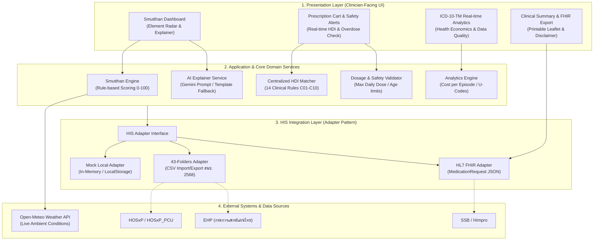
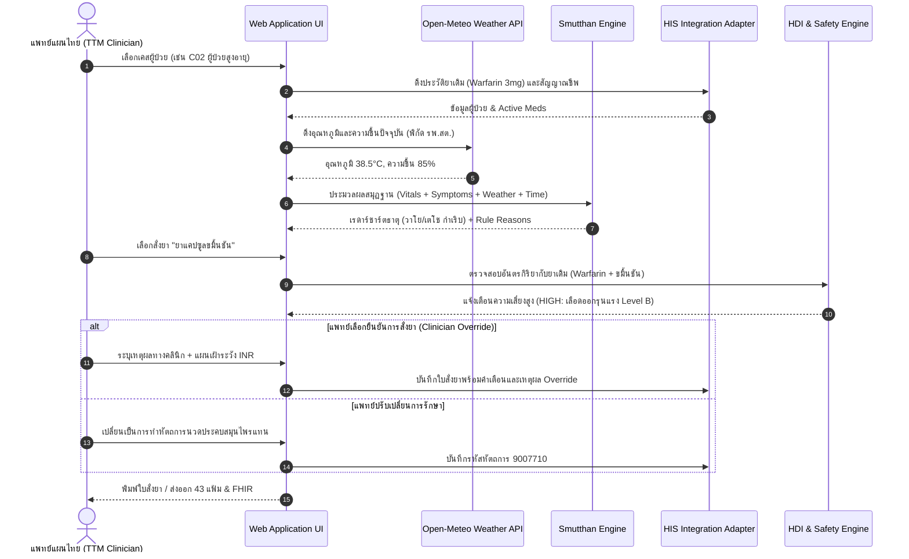

# สถาปัตยกรรมระบบและการเชื่อมต่อสารสนเทศ (System Architecture & HIS Integration)
**โครงการ:** TTM Smutthan Engine Platform — Hackathon 2026  
**ข้อความปฏิเสธความรับผิดชอบ:** *เอกสารนี้ใช้สำหรับข้อมูลสังเคราะห์เพื่อการสาธิตการแข่งขัน Hackathon 2026 เท่านั้น มิใช่ข้อมูลผู้ป่วยจริง*

---

## 1. แผนผังสถาปัตยกรรมระบบ (System Architecture)



---

## 2. ลำดับการไหลของข้อมูล (Data Flow Diagram)



---

## 3. สถาปัตยกรรม Adapter Pattern สำหรับเชื่อมต่อ HIS

ระบบได้รับการออกแบบโดยยึดหลัก **Clean Architecture** และ **Hexagonal / Adapter Pattern** เพื่อให้สามารถเสียบต่อกับระบบ HIS ของโรงพยาบาลได้ทุกระบบโดยไม่ต้องแก้ไขโค้ดการทำงานหลัก:

```typescript
export interface HisAdapter {
  getPatientDemographics(hn: string): Promise<PatientInfo>;
  getActiveMedications(hn: string): Promise<CurrentMedication[]>;
  getEncounterVitals(vn: string): Promise<Vitals>;
  submitPrescription(prescription: PrescriptionSubmission): Promise<PrescriptionResponse>;
  exportFortyThreeFolders(dateRange: DateRange): Promise<Blob>;
}
```

### การรองรับระบบ HIS ในประเทศไทย:
1. **HOSxP / HOSxP_PCU:** เชื่อมต่อผ่าน MySQL Replication หรือ REST API Gateway ของ BMS
2. **EHP (Electronic Health Record กรมการแพทย์แผนไทย):** ส่งออกและนำเข้าข้อมูลประวัติการตรวจวินิจฉัยและรหัสยาแผนไทย
3. **SSB / Himpro:** เชื่อมต่อผ่าน HL7 FHIR MedicationRequest Endpoint
4. **Offline Local Fallback:** บันทึกข้อมูลบน LocalStorage ของบราวเซอร์ เมื่อเครือข่ายอินเทอร์เน็ตของ รพ.สต. ขัดข้อง

---

## 4. โครงสร้างข้อมูล HL7 FHIR MedicationRequest Resource

ใบสั่งยาจากแพลตฟอร์มสามารถแปลงเป็นมาตรฐานสากล **HL7 FHIR R4 MedicationRequest** ได้ทันที:

```json
{
  "resourceType": "MedicationRequest",
  "id": "rx-c02-001",
  "status": "active",
  "intent": "order",
  "category": [
    {
      "coding": [
        {
          "system": "http://terminology.hl7.org/CodeSystem/medicationrequest-category",
          "code": "outpatient",
          "display": "Outpatient"
        }
      ]
    }
  ],
  "medicationCodeableConcept": {
    "coding": [
      {
        "system": "https://moph.go.th/standards/ttm/drug24",
        "code": "410000000122019150011402",
        "display": "ยาแคปซูลขมิ้นชัน"
      }
    ],
    "text": "ยาแคปซูลขมิ้นชัน (500 มก.)"
  },
  "subject": {
    "reference": "Patient/HN-2568002",
    "display": "นางสมจิตต์ (ข้อมูลสังเคราะห์เพื่อการสาธิต)"
  },
  "dosageInstruction": [
    {
      "text": "รับประทานครั้งละ 1 แคปซูล วันละ 3 ครั้ง หลังอาหาร เช้า-กลางวัน-เย็น",
      "timing": {
        "repeat": {
          "frequency": 3,
          "period": 1,
          "periodUnit": "d"
        }
      }
    }
  ],
  "note": [
    {
      "text": "Decision Support: แจ้งเตือนอันตรกิริยากับ Warfarin ความเสี่ยงสูง (Bleeding risk). แพทย์ยืนยันการสั่งใช้พร้อมนัดติดตาม INR."
    }
  ]
}
```

---

## 5. มาตรการความมั่นคงปลอดภัยและการปกป้องข้อมูลส่วนบุคคล (Security & Privacy)

1. **Zero Real Patient Data:** ในช่วงการแข่งขันและพัฒนานี้ ใช้ข้อมูลสังเคราะห์ (Synthetic Data) 100%
2. **PII Masking & De-identification:**
   - เลขบัตรประชาชนถูก Masked เป็น `1-1004-XXXXX-01-1`
   - เบอร์โทรศัพท์ถูก Masked เป็น `081-XXX-4501`
   - มีสคริปต์ตรวจสอบก่อน Commit (`scripts/check-pii.py`) รันผ่าน CI/CD
3. **Data Segregation:** ข้อมูลการคำนวณและกฎเกณฑ์ (Rules) แยกออกจากข้อมูลผู้ป่วยอย่างเด็ดขาด
