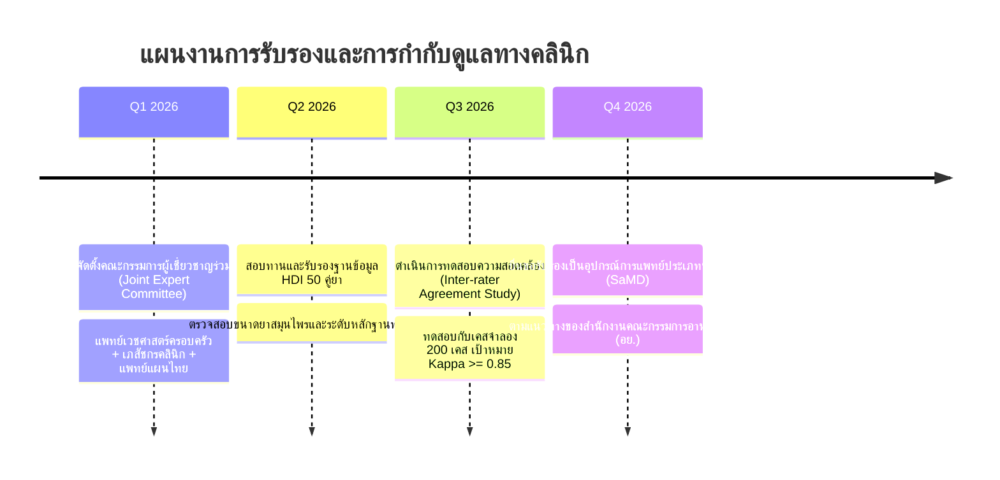

# ความเป็นไปได้ทางเทคนิคและการบริหารความเสี่ยง (Technical Feasibility & Risk Management)
**โครงการ:** TTM Smutthan Engine Platform — Hackathon 2026  
**ข้อความปฏิเสธความรับผิดชอบ:** *เอกสารนี้ใช้สำหรับข้อมูลสังเคราะห์เพื่อการสาธิตการแข่งขัน Hackathon 2026 เท่านั้น มิใช่ข้อมูลผู้ป่วยจริง*

---

## 1. การประเมินความเป็นไปได้ทางเทคนิค (Technical Feasibility Assessment)

### 1.1 ความเข้ากันได้กับระบบสารสนเทศสุขภาพของไทย (Compatibility with Thai Health IT)
- **สถาปัตยกรรม Web-based Zero-Footprint:** พัฒนาด้วย React + TypeScript และบันเดิลเป็น Static Assets ทำให้สามารถติดตั้งบน Local Web Server ของโรงพยาบาล (Apache/Nginx/Node) หรือรันเป็น Electron Sidecar บนเครื่องหมอแผนไทยได้โดยไม่ต้องเปลี่ยนเครื่องคอมพิวเตอร์
- **มาตรฐานข้อมูลของกระทรวงสาธารณสุข:**
  - รองรับโครงสร้าง **43 แฟ้มมาตรฐาน (สนย. 2568)** ได้แก่ แฟ้ม `DRUG_OPD`, `DIAGNOSIS_OPD`, `PROCEDURE_OPD`
  - รองรับรหัสยาแผนไทย **24 หลัก** ตามประกาศกรมการแพทย์แผนไทยและการแพทย์ทางเลือก
  - รองรับรหัสโรค **ICD-10-TM (กลุ่มรหัส U)** และรหัสหัตถการทางการแพทย์แผนไทย

### 1.2 ข้อจำกัดด้านโครงสร้างพื้นฐานระดับ รพ.สต. (Primary Care Infrastructure Constraints)
โรงพยาบาลส่งเสริมสุขภาพตำบล (รพ.สต.) ในประเทศไทยมักเผชิญข้อจำกัด 3 ประการ:
1. **สัญญาณอินเทอร์เน็ตไม่เสถียร (Intermittent Connectivity):**
   - *แนวทางแก้ปัญหา:* ออกแบบให้ Core Engine ทำงานบน Client-Side Browser 100% ระบบสามารถคำนวณสมุฏฐานธาตุและตรวจจับ HDI ได้อย่างสมบูรณ์แม้ไม่มีการเชื่อมต่อภายนอก (Offline First)
2. **เครื่องคอมพิวเตอร์สเปกจำกัด (Legacy Hardware):**
   - *แนวทางแก้ปัญหา:* แอพพลิเคชันมีขนาด Bundle ที่บีบอัดแล้วต่ำกว่า 900 KB ใช้เวลาโหลดต่ำกว่า 1.5 วินาทีบนเครือข่าย 3G/4G
3. **การเข้าถึง API ภายนอก (External API Dependencies):**
   - *แนวทางแก้ปัญหา:* กรณีไม่สามารถเรียก Open-Meteo Weather API ได้ ระบบจะสลับไปใช้ค่าภูมิอากาศเฉลี่ยตามฤดูกาลของจังหวัดนั้นๆ (Historical Weather Fallback)

---

## 2. การวิเคราะห์ความเสี่ยงและมาตรการบรรเทาผลกระทบ (Risk Matrix & Mitigation Strategies)

| ความเสี่ยง (Risk Category) | ระดับผลกระทบ | โอกาสเกิด | มาตรการบรรเทาผลกระทบ (Mitigation Strategy) |
|---|:---:|:---:|---|
| **ความปลอดภัยทางคลินิก (Clinical Safety):** แพทย์เชื่อคำแนะนำของระบบโดยไม่ตรวจประเมินร่างกาย | สูง | ต่ำ | แสดงแบนเนอร์ **Clinical Decision Support Disclaimer** ชัดเจนทุกหน้าจอ และบังคับให้แพทย์ต้องคลิกยืนยันการรับทราบคำเตือนก่อนออกใบสั่งยา |
| **ความคลาดเคลื่อนของกฎอันตรกิริยา (HDI Inaccuracy):** กฎ HDI ขัดแย้งกับหลักฐานวิชาการใหม่ | สูง | ต่ำ | ทุกกฎในฐานข้อมูลระบุ **Evidence Level (A–D)**, แหล่งอ้างอิง และสถานะ "รอเภสัชกร/แพทย์แผนไทยตรวจสอบ" พร้อมระบบ Admin ให้ผู้เชี่ยวชาญแก้ไขกฎได้ |
| **การรั่วไหลของข้อมูลส่วนบุคคล (PII Leakage):** ข้อมูลผู้ป่วยจริงหลุดออกสู่ภายนอก | ร้ายแรง | ต่ำมาก | ไม่มีข้อมูลผู้ป่วยจริงในระบบ (ใช้ Synthetic Data 100%), มี Pre-commit Hook สแกน PII, และมีระบบ De-identification ก่อนนำเข้าข้อมูล |
| **การต่อต้านจากผู้ใช้งาน (User Resistance):** แพทย์รู้สึกว่าระบบเพิ่มภาระการทำงาน (Click Fatigue) | ปานกลาง | ปานกลาง | ออกแบบ UX ให้ขั้นตอนทั้งหมดเสร็จสิ้นภายใน 3 คลิก เชื่อมโยงข้อมูลอัตโนมัติจาก HIS เดิมโดยไม่ต้องพิมพ์ซ้ำ |

---

## 3. แผนการกำกับดูแลทางวิชาการ (Clinical Governance & Expert Review Roadmap)

---

## 4. ประมาณการต้นทุนการดูแลรักษาระบบ (Estimated Operational Cost)

| รายการทรัพยากร (Resource Item) | ค่าใช้จ่ายต่อเดือน (THB) | หมายเหตุ |
|---|:---:|---|
| Web & API Hosting (Cloud or Hospital Server) | 0 - 500 บาท | ใช้ทรัพยากรต่ำมาก สามารถ Host รวมกับ Server เดิมของ รพ.สต. ได้ |
| Open-Meteo Weather API | 0 บาท | ใช้งาน Non-commercial Tier ฟรี (สูงสุด 10,000 calls/day) |
| ค่าบำรุงรักษาและการปรับปรุงฐานข้อมูลวิชาการ | ประชุมรายไตรมาส | ใช้กลไกคณะกรรมการเภสัชกรรมและการบำบัด (PTC) ของ รพช. |
| **รวมต้นทุนการดำเนินงานพื้นฐาน** | **แทบไม่มีค่าใช้จ่ายเพิ่มเติม (Near Zero Marginal Cost)** | |
