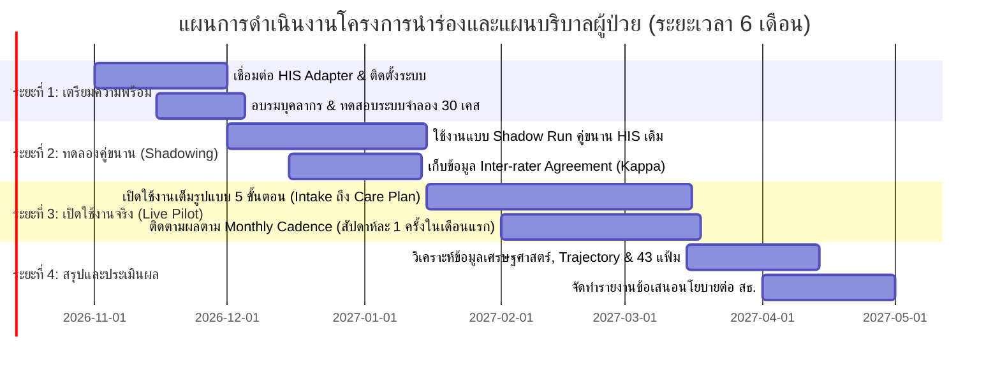

# แผนการนำร่องในพื้นที่จริง (Pilot Implementation Plan)
**โครงการ:** TTM Smutthan Engine Platform — Hackathon 2026  
**ทีมพัฒนา:** **ทีม VejVivat (เวชวิวัฒน์) — Thai Medicine AI Innovation**  
**ข้อความปฏิเสธความรับผิดชอบ:** *เอกสารนี้ใช้สำหรับข้อมูลสังเคราะห์เพื่อการสาธิตการแข่งขัน Hackathon 2026 เท่านั้น มิใช่ข้อมูลผู้ป่วยจริง*

---

## 1. คุณลักษณะพื้นที่นำร่องเป้าหมาย (Pilot Site Profile)

เพื่อพิสูจน์คุณค่าของระบบในสภาวะการทำงานจริง ได้กำหนดคุณลักษณะของพื้นที่นำร่องดังนี้:
- **หน่วยบริการปฐมภูมิเป้าหมาย:** โรงพยาบาลส่งเสริมสุขภาพตำบล (รพ.สต.) ขนาดกลาง-ใหญ่ จำนวน 3-5 แห่ง ในเครือข่ายโรงพยาบาลชุมชน (CUP: Contracting Unit for Primary Care) เช่น เครือข่าย รพ.บางกระทุ่ม จ.พิษณุโลก
- **บุคลากรประจำพื้นที่:**
  - แพทย์แผนไทยปฏิบัติการ 1–2 คนต่อ รพ.สต.
  - พยาบาลวิชาชีพ / ผอ.รพ.สต.
  - แพทย์เวชปฏิบัติทั่วไปและเภสัชกร รพช. ที่ดูแลรับผิดชอบเครือข่ายปฐมภูมิ
- **ปริมาณผู้รับบริการ:** มีผู้ป่วยนอกเข้ารับบริการแพทย์แผนไทยเฉลี่ย 15–25 คน/วัน โดยมีสัดส่วนผู้ป่วยโรคเรื้อรัง (NCDs) รับประทานยาแผนปัจจุบันร่วมด้วยไม่น้อยกว่า 40%

---

## 2. ขั้นตอนการดำเนินงานนำร่อง 4 ระยะ (4-Phase Pilot Roadmap)

### รายละเอียดในแต่ละระยะ:
1. **ระยะที่ 1: เตรียมความพร้อมและการติดตั้ง (Preparation & Onboarding - 1 เดือน):**
   - ติดตั้ง Web Application บน Local Server ของ รพ.สต. หรือใช้งานผ่าน GitHub Pages Web Portal
   - เชื่อมต่อ Adapter ดึงข้อมูลประวัติยาจาก HOSxP_PCU / EHP และทดสอบระบบลงทะเบียนคนไข้ใหม่ (`PatientIntakeModal`)
   - จัดอบรมแพทย์แผนไทยและเจ้าหน้าที่ 1 วัน
2. **ระยะที่ 2: ทดลองใช้งานแบบคู่ขนาน (Shadow Running - 1.5 เดือน):**
   - แพทย์แผนไทยตรวจรักษาตามปกติ และบันทึกข้อมูลซ้ำในระบบ TTM Smutthan Engine ควบคู่กัน
   - วัดผลความสอดคล้องในการวินิจฉัย (Cohen's Kappa) และคัดกรองปัญหาทางเทคนิค
3. **ระยะที่ 3: เปิดใช้งานจริงในเวชปฏิบัติพร้อมแผนการรักษา (Active Live Pilot & Care Plan - 2 เดือน):**
   - ใช้ระบบในการคัดกรองยาอันตรกิริยา (HDI) ก่อนสั่งยาจริง
   - บังคับใช้เกณฑ์การติดตามผลตามระดับความเสี่ยง (Evidence-Based Monthly Cadence):
     - **ผู้ป่วยกลุ่มเสี่ยงสูง (High Risk):** นัดติดตามผล 4 ครั้งในเดือนแรก (สัปดาห์ละ 1 ครั้ง) เพื่อตรวจ INR, ความดันโลหิต และอาการเลือดออก
     - **ผู้ป่วยกลุ่มเสี่ยงปานกลาง (Moderate Risk):** นัดติดตามผล 2 ครั้งในเดือนแรก (ทุก 2 สัปดาห์)
     - **ผู้ป่วยกลุ่มเสี่ยงต่ำ (Low Risk):** นัดติดตามผล 1 ครั้งต่อเดือน
   - จัด Case Conference ประจำสัปดาห์ระหว่างแพทย์แผนปัจจุบัน แพทย์แผนไทย และเภสัชกร
4. **ระยะที่ 4: ประเมินผลความคุ้มค่าและขยายผล (Evaluation & Scale-up - 1.5 เดือน):**
   - ประเมินอัตราการเกิดอาการไม่พึงประสงค์จากการใช้ยา
   - ประเมินผลลัพธ์ผ่าน Longitudinal Trajectory Dashboard (ระดับความปวด VAS ลดลง และสมดุลตรีธาตุคืนสู่ปกติ)
   - คำนวณต้นทุนต่อเคสเปรียบเทียบก่อนและหลังใช้ระบบ และส่งออกข้อมูล 43 แฟ้มเข้าสู่ HDC

---

## 3. ดัชนีชี้วัดความสำเร็จของโครงการนำร่อง (Pilot Success Indicators)

| ตัวชี้วัด (Indicator) | เกณฑ์เป้าหมาย (Benchmark) | วิธีการวัดผล |
|---|:---:|---|
| **อุบัติการณ์การจ่ายยา HDI ความเสี่ยงสูง** | **0 เคส (ลดลง 100%)** | ตรวจสอบจากเวชระเบียนและแฟ้ม `DRUG_OPD` |
| **อัตราการติดตามผลครบตามกำหนด (Follow-up Compliance)** | **>= 90% ของกลุ่มเสี่ยงสูง** | ตรวจสอบจากบันทึกการนัดและตาราง Cadence |
| **การลดลงของระดับความปวด (VAS Pain Reduction)** | **ลดลง >= 50% ภายใน 4 สัปดาห์** | บันทึกผ่าน Trajectory Dashboard |
| **ความพึงพอใจของแพทย์แผนไทย** | **>= 85%** | แบบประเมิน System Usability Scale (SUS) |
| **ความเชื่อมั่นของแพทย์แผนปัจจุบันต่อการรักษาแผนไทย** | **เพิ่มขึ้นอย่างมีนัยสำคัญ (p < 0.05)** | แบบสอบถามทัศนคติก่อน-หลังโครงการ |
| **ความสมบูรณ์ของการบันทึกรหัส ICD-10-TM** | **>= 95%** | ตรวจสอบความถูกต้องของแฟ้ม `DIAGNOSIS_OPD` |
| **ระยะเวลาเฉลี่ยในการตรวจคัดกรองประวัติยาและออกแผนการรักษา** | **< 2.5 นาที/คนไข้** | Time-motion study ในคลินิก |
