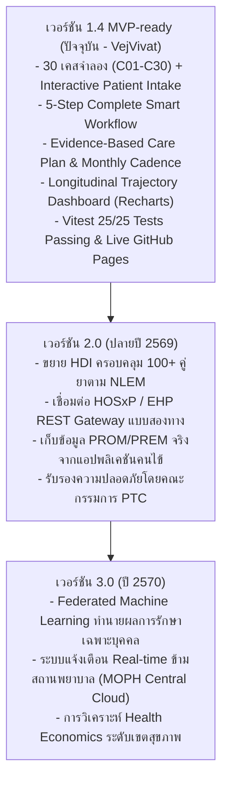

# ข้อจำกัดของระบบและแนวทางการพัฒนาต่อ (Known Limitations & Future Roadmap)
**โครงการ:** TTM Smutthan Engine Platform — Hackathon 2026  
**ทีมพัฒนา:** **ทีม VejVivat (เวชวิวัฒน์) — Thai Medicine AI Innovation**  
**ข้อความปฏิเสธความรับผิดชอบ:** *เอกสารนี้ใช้สำหรับข้อมูลสังเคราะห์เพื่อการสาธิตการแข่งขัน Hackathon 2026 เท่านั้น มิใช่ข้อมูลผู้ป่วยจริง*

---

## 1. ข้อจำกัดของระบบในเวอร์ชันปัจจุบัน (Current Limitations)

1. **การใช้ข้อมูลสังเคราะห์และการลงทะเบียนจำลอง (Synthetic Cohort & Intake Boundary):**
   - เคสจำลอง C01 ถึง C30 รวมถึงระบบลงทะเบียนผู้ป่วยใหม่ (`PatientIntakeModal`) ใช้ **ข้อมูลที่ถูกสังเคราะห์ขึ้นตามหลักวิชาการเวชกรรมไทยและเภสัชกรรมสมุนไพรเพื่อการสาธิตเท่านั้น** ข้อมูลถูกบันทึกบน LocalStorage และ Mock Adapters เพื่อการประเมินแบบ Zero-PII มิใช่เวชระเบียนจริงของกระทรวงสาธารณสุข
2. **ขอบเขตของฐานข้อมูลอันตรกิริยายา (HDI Database Scope):**
   - ในเวอร์ชัน MVP-ready มีการรวบรวมคู่ยาอันตรกิริยาที่พบบ่อยครอบคลุม 30 เคสหลัก (เช่น Warfarin, Amlodipine, Digoxin, Metformin, Aspirin) แต่ยังไม่ครอบคลุมยาสมุนไพรเดี่ยวและยาตำรับทั้งหมดกว่า 80 รายการในบัญชียาหลักแห่งชาติ
   - สถานะข้อมูลในปัจจุบันจัดอยู่ในหมวด **"ตัวอย่าง รอเภสัชกร/แพทย์แผนไทยตรวจสอบ"**
3. **แบบจำลองแนวโน้มการฟื้นฟู (Trajectory Model Assumptions):**
   - กราฟแนวโน้มระยะยาว (Longitudinal Trajectory) ในโมดูล Care Plan สร้างขึ้นจากการประมาณการณ์ทางคลินิก (Clinical Heuristic Model) อิงตามค่ามัธยฐานของการฟื้นฟูในเวชปฏิบัติแผนไทย ในสถานการณ์จริง จำเป็นต้องเก็บข้อมูลผลลัพธ์จริง (PROM/PREM) เพื่อปรับแต่งโมเดลการพยากรณ์ด้วย Machine Learning
4. **ปัจจัยทางทฤษฎีสมุฏฐานที่ยังไม่ได้นำมาคำนวณ (Unmodeled TTM Factors):**
   - ในทฤษฎีการแพทย์แผนไทยโบราณ ยังมีปัจจัยอื่นๆ เช่น **ประเทศสมุฏฐาน (ถิ่นที่อยู่อาศัยตามภูมิประเทศ)**, **ข้างขึ้น-ข้างแรม (จันทรคติ)**, และ **พฤติกรรมก่อโรค (มูลเหตุเกิดโรค 8 ประการ เช่น กินอาหารผิดเวลา กลั้นอุจจาระ-ปัสสาวะ)** ซึ่งในเวอร์ชันนี้ยังไม่ได้เปิดรับข้อมูลเหล่านี้เข้าสู่สมการ
5. **การคำนวณสภาพอากาศในร่ม (Microclimate vs Outdoor Weather):**
   - Open-Meteo API ให้ข้อมูลสภาพอากาศภายนอกอาคาร (Ambient Outdoor) แต่ผู้ป่วยอาจอาศัยอยู่ในห้องปรับอากาศ (Air Conditioning) ซึ่งอาจทำให้อุณหภูมิและเสมหะสมุฏฐานจริงเบี่ยงเบนไปจากค่าพยากรณ์

---

## 2. สถานะทางกฎหมายและการกำกับดูแล (Regulatory Status & Compliance)

- **Clinical Decision Support System (CDSS):**
  - แพลตฟอร์มนี้จัดเป็น **ระบบสนับสนุนการตัดสินใจทางคลินิก (CDSS)** มิใช่อุปกรณ์วินิจฉัยโรคอัตโนมัติ (Automated Diagnostic Device)
  - ความรับผิดชอบในการตรวจร่างกาย วินิจฉัย สั่งจ่ายยา และจัดทำแผนการรักษายังคงเป็นของ **ผู้ประกอบวิชาชีพการแพทย์แผนไทยและแพทย์ผู้มีใบอนุญาต** อย่างสมบูรณ์
- **แนวทางซอฟต์แวร์ทางการแพทย์ (Software as a Medical Device - SaMD):**
  - ในการนำไปใช้งานจริงเชิงพาณิชย์หรือในโรงพยาบาล จะต้องดำเนินการยื่นขอการรับรองมาตรฐาน SaMD ตามประกาศของสำนักงานคณะกรรมการอาหารและยา (อย.) และผ่านการรับรองความปลอดภัยทางสารสนเทศ (ISO 27001 / HIPAA / PDPA)

---

## 3. แผนการพัฒนาในอนาคต (Future Roadmap)

