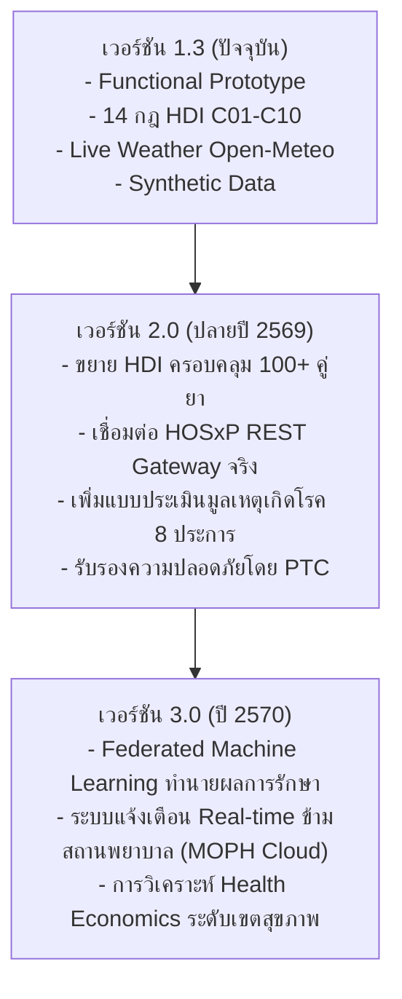

# ข้อจำกัดของระบบและแนวทางการพัฒนาต่อ (Known Limitations & Future Roadmap)
**โครงการ:** TTM Smutthan Engine Platform — Hackathon 2026  
**ข้อความปฏิเสธความรับผิดชอบ:** *เอกสารนี้ใช้สำหรับข้อมูลสังเคราะห์เพื่อการสาธิตการแข่งขัน Hackathon 2026 เท่านั้น มิใช่ข้อมูลผู้ป่วยจริง*

---

## 1. ข้อจำกัดของระบบในเวอร์ชันปัจจุบัน (Current Limitations)

1. **การใช้ข้อมูลสังเคราะห์เพื่อการสาธิต (Strict Synthetic Data Boundary):**
   - ผู้ป่วยเคส C01 ถึง C10 และประวัติการรับบริการย้อนหลัง 51 ครั้ง เป็น **ข้อมูลที่ถูกสังเคราะห์ขึ้นตามหลักวิชาการเพื่อการแข่งขัน Hackathon เท่านั้น** มิใช่ข้อมูลผู้ป่วยจริง และยังไม่สามารถใช้เป็นหลักฐานยืนยันผลการรักษาทางสถิติระดับประเทศได้
2. **ขอบเขตของฐานข้อมูลอันตรกิริยายา (HDI Database Scope):**
   - ในเวอร์ชัน 1.3 มีการรวบรวมคู่ยาอันตรกิริยาจำนวน 14 คู่ ซึ่งครอบคลุมเคสตัวอย่างหลัก (เช่น Warfarin, Amlodipine, Digoxin, Metformin) แต่ยังไม่ครอบคลุมยาสมุนไพรทั้งหมดกว่า 80 รายการในบัญชียาหลักแห่งชาติ
   - สถานะข้อมูลในปัจจุบันจัดอยู่ในหมวด **"ตัวอย่าง รอเภสัชกร/แพทย์แผนไทยตรวจสอบ"**
3. **ปัจจัยทางทฤษฎีสมุฏฐานที่ยังไม่ได้นำมาคำนวณ (Unmodeled TTM Factors):**
   - ในทฤษฎีการแพทย์แผนไทยโบราณ ยังมีปัจจัยอื่นๆ เช่น **ประเทศสมุฏฐาน (ถิ่นที่อยู่อาศัยตามภูมิประเทศ)**, **ข้างขึ้น-ข้างแรม (จันทรคติ)**, และ **พฤติกรรมก่อโรค (มูลเหตุเกิดโรค 8 ประการ เช่น กินอาหารผิดเวลา กลั้นอุจจาระ-ปัสสาวะ)** ซึ่งในเวอร์ชันนี้ยังไม่ได้เปิดรับข้อมูลเหล่านี้เข้าสู่สมการ
4. **การคำนวณสภาพอากาศในร่ม (Microclimate vs Outdoor Weather):**
   - Open-Meteo API ให้ข้อมูลสภาพอากาศภายนอกอาคาร (Ambient Outdoor) แต่ผู้ป่วยอาจอาศัยอยู่ในห้องปรับอากาศ (Air Conditioning) ซึ่งอาจทำให้อุณหภูมิและเสมหะสมุฏฐานจริงเบี่ยงเบนไปจากค่าพยากรณ์

---

## 2. สถานะทางกฎหมายและการกำกับดูแล (Regulatory Status & Compliance)

- **Clinical Decision Support System (CDSS):**
  - แพลตฟอร์มนี้จัดเป็น **ระบบสนับสนุนการตัดสินใจทางคลินิก (CDSS)** มิใช่อุปกรณ์วินิจฉัยโรคอัตโนมัติ (Automated Diagnostic Device)
  - ความรับผิดชอบในการตรวจร่างกาย วินิจฉัย และสั่งจ่ายยายังคงเป็นของ **ผู้ประกอบวิชาชีพการแพทย์แผนไทยและแพทย์ผู้มีใบอนุญาต** อย่างสมบูรณ์
- **แนวทางซอฟต์แวร์ทางการแพทย์ (Software as a Medical Device - SaMD):**
  - ในการนำไปใช้งานจริงเชิงพาณิชย์หรือในโรงพยาบาล จะต้องดำเนินการยื่นขอการรับรองมาตรฐาน SaMD ตามประกาศของสำนักงานคณะกรรมการอาหารและยา (อย.) และผ่านการรับรองความปลอดภัยทางสารสนเทศ (ISO 27001 / HIPAA / PDPA)

---

## 3. แผนการพัฒนาในอนาคต (Future Roadmap)

